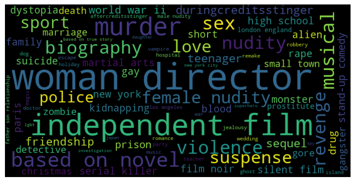

# Movie Recommender Systems

Recommendation System has various goal: discover new items, find things we have seen before, find similar items, personalize recommended items for users, etc. Our goal in this project aims to try different methods and find out which model is the solution to goals mentioned above.

In this project, we are going to establish recommendation systems such as popularity-based, content-based, collaborative filtering, and hybrid recommendation systems. Naive movie recommender provides generalized recommendations to each user based on the popularity of each movie without considering the preference of users. It is handy but recommends the same movies for all users. To address the issue, content-based filtering (CBF) model recommends movie based on the content of items, such as cast, genres, keywords, overview, etc.. The recommendations are generated based on the similarity between a given movie and its neighbors. Nevertheless, content-based recommendation system is still not perfect. One of its disadvantages is that it cannot capture the personal tastes owing to only suggesting movies which have higher closeness to a certain kind of movie. Collaborative filtering (CF), the most widely used method, can solve the problem that CBF encounters. This model is based on the users’ previous behavior and preference and predict what they would like based on similarity with other users. In addition, we try to build hybrid recommendation systems by combining benefits from popularity, CBF and CF, and we hope the hybrid model can improve the performance of our recommendation systems.

## 1. Dataset
The dataset is from [Full MovieLens Dataset](https://www.kaggle.com/rounakbanik/the-movies-dataset) including rating and description from both TMDB and IMDB. Please go to the link above to see more details.

## 2. Data Exploration

### 2-1. Popular Movies:
| Movie Title                    | Popularity |
| ------------------------------ | ---------- |
| Minions                        | 547.488298 |
| Wonder Woman                   | 294.337037 |
| Beauty and the Beast           | 287.253654 |
| Baby Driver                    | 228.032744 |
| Big Hero 6                     | 213.849907 |
| Deadpool                       | 187.860492 |
| Guardians of the Galaxy Vol. 2 | 185.330992 |
| Avatar                         | 185.070892 |
| John Wick                      | 183.870374 |

### 2-2. Popular Directors:

### 2-3. Popular Casts:

### 2-4. Genres

### 2-5. Keywords:

### 2-6. Rating Distribution:

### 2-7. Release Date:

## 3. Results

### 3-1. Popularity-based model

| Seq. | Title                       |
| ---- | --------------------------- |
| 1    | Pulp Fiction                |
| 2    | Forrest Gump                |
| 3    | The ShawShank Redemption    |
| 4    | The Silence of the Lambs    |
| 5    | Jurassic Park               |
| 6    | Star Wars                   |
| 7    | The Matrix                  |
| 8    | Toy Story                   |
| 9    | Schindler’s List            |
| 10   | Terminator 2: Judgement Day |

### 3-2. Content-based model
1. Recommendations based on `Toy Story`

| Seq. | Title                                           |
| ---- | ----------------------------------------------- |
| 1    | Toy Story 2                                     |
| 2    | Toy Story 3                                     |
| 3    | Toy Story of Terror!                            |
| 4    | Toy Story That Time Forgot                      |
| 5    | Small Fry                                       |
| 6    | Hawaiian Vacation                               |
| 7    | Partysaurus Rex                                 |
| 8    | Tom and Jerry: Shiver Me Whiskers               |
| 9    | The Tangerine Bear: Home in Time for Christmas! |
| 10   | Superstar Goofy                                 |

2. Recommendations based on `Iron Man`

| Seq. | Title                           |
| ---- | ------------------------------- |
| 1    | Iron Man 2                      |
| 2    | Iron Man 3                      |
| 3    | Jocks                           |
| 4    | Avengers: Age of Ultron         |
| 5    | Ant-Man                         |
| 6    | The Invincible Iron Man         |
| 7    | Thor                            |
| 8    | Marvel One-Shot: The Consultant |
| 9    | Iron Man & Hulk: Heroes United  |
| 10   | Relentless                      |